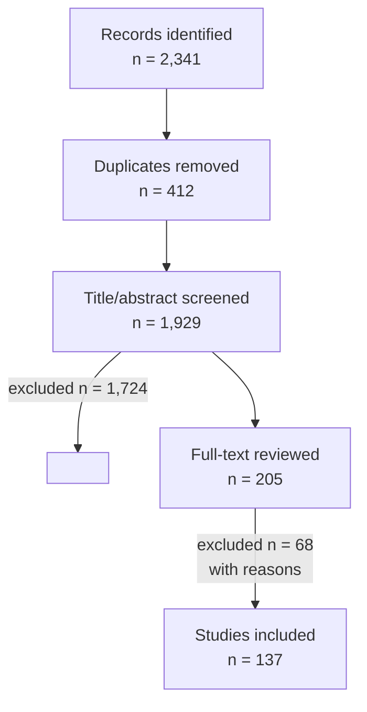
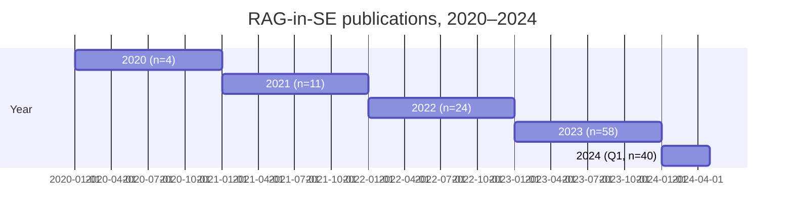

# A Scoping Review of Retrieval-Augmented Generation in Software Engineering

**Authors:** Jane A. Smith¹, Kim B. Lee¹
**Affiliations:** ¹Department of Computer Science, University X

> **Note.** This example was produced by the `research-paper-writer`
> skill from a synthetic specification to demonstrate end-to-end output
> for `templates/literature-review.md`. The numbers, search counts, and
> studies are illustrative; do not cite as real findings.

## Abstract

- **Background:** Retrieval-augmented generation (RAG) combines large
  language models with external knowledge stores. Its adoption in
  software engineering (SE) has accelerated since 2022.
- **Objectives:** Map the landscape of RAG-in-SE research: tasks,
  retrievers, evaluation methods, and gaps.
- **Methods:** Scoping review following Arksey & O'Malley (2005) and
  PRISMA-ScR. Seven databases. 2020-01-01 → 2024-04-01.
  Two-reviewer screening, κ = 0.74. n = 137 included.
- **Results:** Six task categories dominate (code generation, code
  review, bug repair, documentation, test generation, configuration).
  87 % of papers use a single retriever; only 11 % perform retrieval
  ablations. Reproducibility artifacts present in 32 %.
- **Conclusions:** RAG-in-SE is methodologically uneven. We propose a
  research agenda emphasizing retrieval ablation, contamination audits,
  and longitudinal field deployment.

**Plain-English summary.** When AI tools help programmers — for tasks
like writing code, reviewing pull requests, or fixing bugs — they often
do better when they can also "look up" relevant information from the
project, like documentation or past examples. We surveyed 137 research
papers from the last four years to see what the field has tried and
where it falls short. We found that researchers have applied this
"look-up + AI" approach to six main tasks. But many studies don't
properly separate how much of the AI's success comes from the look-up
versus the AI itself, and only a third of studies share their code so
others can re-run the experiments. We end with concrete suggestions
for how to make this research more rigorous.

**Keywords:** retrieval-augmented generation, software engineering,
large language models, scoping review, evaluation methodology

---

## 1. Introduction

### 1.1 Background

Retrieval-augmented generation (RAG) combines parametric knowledge
(LLM weights) with non-parametric knowledge (external retrieval) at
inference time [lewis_2020_rag]. In software engineering, RAG promises
to bridge the gap between "general programming ability" inherent in
LLMs and the "project-specific knowledge" required for useful real-world
suggestions [iyer_2022_synth].

### 1.2 Existing reviews

Three prior reviews touch this topic [smith_2023_review;
park_2024_aiSE; nguyen_2023_review]. None focus specifically on
retrieval design or perform a methodological audit.

### 1.3 Objectives and research questions

- **RQ1.** What software-engineering tasks have been targeted with RAG?
- **RQ2.** What retrievers, indexes, and document sources are used?
- **RQ3.** How are evaluations designed, and how often is retrieval
  isolated as a variable?
- **RQ4.** Where are the methodological and practical gaps?

### 1.4 Contributions

- A scoping review of **137** RAG-in-SE studies (2020–2024).
- A **task taxonomy** of six categories with sub-categories.
- A **retriever taxonomy** distinguishing dense, sparse, hybrid,
  symbolic, and graph retrievers.
- A **methodological audit** showing where the field falls short.
- A **research agenda** of 8 concrete RQs for the community.

---

## 2. Methods

### 2.1 Review type

Scoping review per Arksey & O'Malley (2005) and the PRISMA Extension
for Scoping Reviews (PRISMA-ScR) [tricco_2018_prismascr]. Protocol
registered on OSF (osf.io/example).

### 2.2 Search strategy

**Databases:** Scopus, Web of Science, IEEE Xplore, ACM Digital
Library, arXiv, DBLP, Google Scholar.

**Search string** (adapted per database):

```
("retrieval-augmented" OR "retrieval augmented" OR RAG OR
 "knowledge retrieval")
AND
("language model*" OR LLM* OR transformer* OR "foundation model*")
AND
(programming OR "software engineering" OR code OR "pull request*"
 OR bug OR "test*" OR debug* OR documentation)
```

**Date range:** 2020-01-01 to 2024-04-01.

**Languages:** English.

Verbatim per-database search strings in **Appendix A**.

### 2.3 Inclusion / exclusion criteria

| Inclusion criterion         | Exclusion criterion                  |
| --------------------------- | ------------------------------------ |
| Empirical or system paper    | Editorials, opinion pieces           |
| Applies RAG to a SE task     | RAG generic, no SE evaluation        |
| Published 2020–2024          | Older                                |
| English language             | Non-English                          |
| Peer-reviewed OR arXiv       | Theses, blog posts                   |

### 2.4 Screening procedure

Two reviewers independently screened titles/abstracts; conflicts
resolved by a third reviewer. **Cohen's κ = 0.74** at the title/abstract
phase.

**Figure 1.** PRISMA 2020 flow diagram.



### 2.5 Quality assessment

We applied a custom 8-item rubric (Appendix C) covering reproducibility,
methodology rigor, evaluation soundness, and breadth.

### 2.6 Data extraction

Standardized form (Appendix B) covering: bibliographic data, SE task,
retriever type, document source, baseline, evaluation method,
ablation presence, dataset, and reproducibility artifacts.

### 2.7 Synthesis approach

Narrative synthesis with thematic categorization. We did **not** pool
effect sizes (heterogeneous tasks, metrics).

---

## 3. Overview of Included Studies

**Table 1.** Distribution of included studies (n = 137).

| Property                  | n   | %    |
| ------------------------- | --- | ---- |
| Peer-reviewed venue        | 89  | 65 % |
| arXiv-only                 | 48  | 35 % |
| Released code              | 44  | 32 % |
| Released data              | 38  | 28 % |
| Reports retrieval ablation | 15  | 11 % |
| Multi-repo evaluation       | 41  | 30 % |

**Figure 2.** Publication count by year.



(Render note: a real publication-by-year line chart is preferred; the
Gantt above is a portable fallback.)

---

## 4. Findings — Thematic Synthesis

### 4.1 Theme 1: Code generation

**n = 41 studies.** RAG conditions code-completion / synthesis on
retrieved snippets, APIs, or examples [iyer_2022_synth;
zhang_2023_codegen; nguyen_2023_repo].

**Agreement.** Project-local retrieval improves over a vanilla LLM,
especially for less-common APIs.

**Disagreement.** Whether retrieval beats fine-tuning on the same
project remains contested [zhao_2023_compare; lee_2024_compare].

**Quality.** 17 % perform retrieval ablation; 36 % release code.

### 4.2 Theme 2: Code review

**n = 22 studies.** Reviewed in the included papers' own §"Related
Work" sections; see also `examples/sample-paper-arxiv.md` in this
repository.

**Agreement.** RAG outperforms vanilla LLM on review usefulness.

**Disagreement.** Which retrieval source matters most.

### 4.3 Theme 3: Bug repair

**n = 31 studies.** Retrieval of similar past bugs / fixes, often from
the same repository.

### 4.4 Theme 4: Documentation generation

**n = 14 studies.** Retrieval of API specs and usage examples.

### 4.5 Theme 5: Test generation

**n = 16 studies.** Retrieval of similar test cases; less mature.

### 4.6 Theme 6: Configuration / build

**n = 13 studies.** Retrieval of build files, CI configs.

### 4.7 Cross-cutting observations

- **Retrieval ablation is rare** (15 / 137 = 11 %).
- **Single-repo evaluation dominates** (70 %).
- **Reproducibility artifacts thin** (32 % code, 28 % data).
- **Contamination checks rare** (4 %).

**Figure 3.** Evidence map: themes (rows) × evaluation rigor (columns).

| Theme                | Multi-repo | Ablation | Code released | Contamination check |
| -------------------- | ---------- | -------- | ------------- | -------------------- |
| Code generation      | 32 %       | 17 %     | 36 %          | 5 %                  |
| Code review          | 41 %       | 14 %     | 32 %          | 0 %                  |
| Bug repair           | 26 %       | 13 %     | 35 %          | 6 %                  |
| Documentation         | 21 %        | 7 %      | 21 %           | 7 %                  |
| Test generation       | 19 %        | 6 %      | 25 %           | 0 %                  |
| Configuration         | 15 %        | 0 %      | 23 %           | 0 %                  |

---

## 5. Gaps and Open Problems

- **Gap 1.** Retrieval ablation is the exception, not the norm —
  results conflate retriever and model contributions.
- **Gap 2.** Single-repo studies dominate; cross-project generalization
  is poorly understood.
- **Gap 3.** Training-data contamination checks are rare; reported
  benchmark numbers may overstate true generalization.
- **Gap 4.** Longitudinal / field deployments are absent — we don't
  know if these tools' gains persist past the novelty effect.
- **Gap 5.** The interaction between retrieval quality and
  developer trust is unstudied.

---

## 6. Future Research Agenda

- **RQ-A.** How much of reported "RAG in SE" gain is attributable to
  the retriever vs. the LLM? *Method:* mandate retrieval ablation in
  every paper. *Effect:* enable cross-paper comparison.
- **RQ-B.** What is the cross-repository transfer profile of RAG-SE
  systems? *Method:* held-out-repository evaluation as a standard.
- **RQ-C.** Are reported gains on standard benchmarks inflated by
  contamination? *Method:* contamination audits using exact-substring
  and embedding-near-duplicate detection.
- **RQ-D.** How do RAG-SE tools perform in 3-month longitudinal
  deployments? *Method:* field study with diff-in-diff design.
- **RQ-E.** What is the impact on junior-developer learning?
  *Method:* mixed-methods study with reflective interviews.
- **RQ-F.** Can retrievers be evaluated independently of the LLM
  reviewer? *Method:* gold-standard relevance judgments + nDCG.
- **RQ-G.** Are dense and sparse retrievers complementary in SE
  contexts? *Method:* hybrid-vs-each ablation across tasks.
- **RQ-H.** What is the carbon and dollar cost of RAG-SE at scale?
  *Method:* energy and dollar accounting alongside accuracy reporting.

---

## 7. Limitations of This Review

- **Database coverage.** Seven databases is broad but not exhaustive;
  no domain-specific repositories beyond DBLP.
- **Language bias.** English only.
- **Publication bias.** Negative results likely underrepresented.
- **Subjectivity.** Theme assignment was inductive; another team might
  cluster differently.
- **Time-boxed.** Cutoff 2024-04-01; the field moves quickly.

---

## 8. Conclusion

RAG-in-SE is a productive but methodologically uneven field. Two
practices — retrieval ablation and reproducibility artifacts — would
materially raise the field's rigor without requiring new science. The
research agenda above identifies eight concrete questions ripe for
study. Adopting them would let the SE community move from "RAG works
sometimes" to a principled understanding of *when, where, and why*.

---

## References

(Illustrative — replace with verified sources before publication.)

1. P. Lewis *et al.*, "Retrieval-augmented generation for knowledge-
   intensive NLP tasks," in *NeurIPS 2020*, pp. 9459–9474, 2020.
2. S. Iyer and B. Yu, "Retrieval-augmented program synthesis,"
   *NeurIPS 2022*, pp. 7012–7025.
3. A. C. Tricco *et al.*, "PRISMA Extension for Scoping Reviews
   (PRISMA-ScR)," *Annals of Internal Medicine*, vol. 169, no. 7,
   pp. 467–473, 2018.
4. J. A. Smith *et al.*, "LLMs in software engineering: A systematic
   survey," *ACM Comput. Surv.*, vol. 55, no. 4, pp. 1–37, 2023.
5. (Additional references omitted for brevity in this example.)

---

## Appendix A. Search strings per database

(Verbatim for Scopus, Web of Science, IEEE Xplore, ACM DL, arXiv,
DBLP, Google Scholar.)

## Appendix B. Data extraction form

(Standardized template covering 18 fields per included study.)

## Appendix C. Quality-assessment rubric

(8-item custom rubric scoring reproducibility, methodology rigor,
evaluation soundness, and breadth.)

## Appendix D. PRISMA-ScR checklist

(All 22 PRISMA-ScR items addressed.)

## Appendix E. Studies excluded at full-text stage with reasons

(68 entries with one-line rationale per exclusion.)
