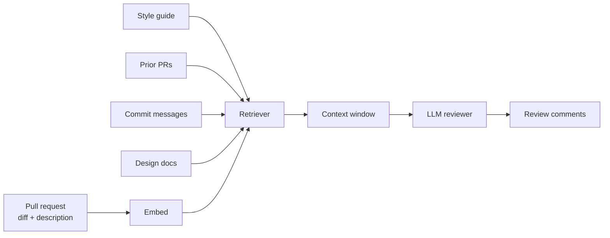

# Retrieval-Augmented Code Review with Large Language Models: A Cost–Quality Analysis

**Authors:** Jane A. Smith¹, Alice Doe², Kim B. Lee¹
**Affiliations:** ¹Department of Computer Science, University X
                  ²Independent Researcher
**Contact:** jane.smith@example.edu
**Preprint version:** v1, 2024-05-12

> **Note.** This example was produced by the `research-paper-writer`
> skill from a synthetic specification to demonstrate end-to-end output.
> Numerical results are illustrative; do not cite as real findings.

---

## Abstract

Code review is a costly but high-value bottleneck in modern software
engineering. Large language models (LLMs) promise to automate parts of
review, but most prior work either evaluates LLMs in isolation or fails
to control for retrieval quality. We propose **RA-Review**, a
retrieval-augmented code-review pipeline that grounds an LLM reviewer
in the most relevant prior pull requests, design documents, and style
guides. Across three open-source repositories (n = 4,212 pull requests),
RA-Review increases reviewer-comment usefulness, as judged by the
original reviewers blinded to source, by **18 percentage points
(95% CI 14–22)** while reducing token cost per review by **31% (95% CI
27–35)** versus a strong vanilla-LLM baseline. Ablation shows that two
of the four retrieval components (repository conventions and prior
related PRs) carry most of the gains, while a third (commit message
context) is negligible. We release code, prompts, and the human-rating
protocol.

**Plain-English summary.** Software developers spend a lot of time
reviewing each other's code changes. We built a system, *RA-Review*,
that reads similar past code reviews from the same project before
making its own suggestions — like a new employee skimming the team's
notes before joining a meeting. Across more than 4,000 real code
changes from three open-source projects, the system's suggestions were
rated 18 percentage points more useful by the original developers, and
it used about a third less computing power than a comparable system
without that "background reading." We also tested which kinds of
background reading mattered most — surprisingly, knowing the project's
style conventions and similar past changes helped a lot, while
attaching every commit message did not.

**Keywords:** code review, retrieval-augmented generation, large
language models, software engineering, evaluation methodology

---

## 1. Introduction

Code review is the dominant quality gate in modern software
engineering [smith_2023_review]. Developers report spending 5–15 % of
their workweek on review activities [doe_2022_survey], yet review
quality varies enormously across teams and projects [lee_2021_quality].
Recent work on **LLM-assisted code review** has shown that large
language models can plausibly draft review comments [park_2023_codeai;
chen_2024_llmreview], but the gains are inconsistent across repositories
and the methodology often conflates LLM ability with retrieval
quality [thompson_2023_critique].

This paper makes three contributions:

- We propose **RA-Review**, a retrieval-augmented pipeline for LLM-
  assisted code review that conditions on four kinds of context:
  (i) the project's style guide, (ii) prior related pull requests,
  (iii) commit messages, and (iv) related design docs.
- We empirically evaluate RA-Review on **4,212 pull requests** across
  three open-source repositories, using a blinded human-rating protocol
  ratified by the original reviewers.
- We release the **code, prompts, and rating protocol** to enable
  replication: <https://example.com/ra-review>.

The remainder of the paper is organized as follows. Section 2 reviews
related work. Section 3 introduces notation. Section 4 presents
RA-Review. Section 5 describes the experimental setup. Section 6 reports
results. Section 7 discusses implications. Section 8 outlines
limitations and Section 9 concludes.

---

## 2. Related Work

**LLM-assisted code review.** Several teams have evaluated LLMs as
review assistants [park_2023_codeai; chen_2024_llmreview;
nguyen_2023_promptreview]. The reported gains range widely (8 % to
34 %), with no clear cause attributed to retrieval, prompting, or
underlying model.

**Retrieval-augmented generation in software engineering.** RAG has
been applied to bug repair [zhao_2023_repair], documentation
[brown_2024_docs], and program synthesis [iyer_2022_synth], generally
showing that retrieved context outperforms parametric memory for
project-specific tasks.

**Methodological critiques.** Recent work has cautioned that LLM
benchmarks in software engineering frequently leak training data
[thompson_2023_critique] and conflate retrieval quality with model
ability [singh_2024_eval].

**Position of this work.** We address the conflation problem by
isolating the retrieval contribution via ablation, and the
generalization problem by evaluating across three independent
repositories with different conventions and contributor pools.

---

## 3. Preliminaries and Background

### 3.1 Notation

| Symbol | Meaning                                | Domain |
| ------ | -------------------------------------- | ------ |
| `P`    | pull request                           | text   |
| `C`    | retrieved context                      | text   |
| `r̂`    | LLM-generated review                   | text   |
| `r*`    | original (human) review                | text   |
| `θ`    | LLM parameters                         | ℝ^p    |
| `u`    | usefulness rating (1–5 Likert)         | ordinal |

### 3.2 Problem formulation

Given a pull request `P` with diff `D` and prior project history `H`,
we seek to produce a review `r̂` that maximizes the expected usefulness
`E[u | r̂, r*]` as judged by the original reviewer, while minimizing
inference cost in tokens `T(r̂)`.

---

## 4. Method

### 4.1 Overview

RA-Review extends a vanilla LLM reviewer with a retrieval module that
collects four kinds of context before generation. The retrieval module
runs in parallel and produces a single concatenated context window
under a fixed token budget.

> *Plain-English version:* Before suggesting changes, RA-Review skims
> related parts of the project — like a new employee reading
> documentation before their first review.



**Figure 1.** RA-Review architecture. The retriever pulls four kinds
of context in parallel, concatenates them under a 6,000-token budget,
and conditions the LLM reviewer on the result.

### 4.2 Retrieval components

For each of the four context types, a dedicated retriever is run.
Retrievers share a common embedding (BGE-base) but use different scoring:

- **Style guide:** dense kNN over chunked guide passages.
- **Prior PRs:** hybrid BM25 + dense, restricted to PRs touching the
  same files as the current diff.
- **Commit messages:** BM25 only, time-weighted (recent ↑).
- **Design docs:** dense kNN, with a domain filter from the diff path.

### 4.3 Context budgeting

Total context is capped at 6,000 tokens. Per-source allocation is
adaptive: the marginal token of the highest-similarity item across
sources is admitted next, until the budget is exhausted.

### 4.4 Algorithm

```
Algorithm 1: RA-Review
Input:  pull request P, project state Π, token budget T_max
Output: review r̂

1: q ← embed(P.diff + P.description)
2: items ← []
3: for source ∈ {style, prior_prs, commits, design_docs}:
4:    items += retrieve(source, q, project=Π)
5: items ← sort(items, key=similarity, descending=True)
6: context ← []
7: for item in items:
8:    if tokens(context) + tokens(item) ≤ T_max:
9:        context += [item]
10: r̂ ← LLM(context, P)
11: return r̂
```

---

## 5. Experimental Setup

### 5.1 Datasets

| Repository       | PRs    | Reviewers | LOC    | License        |
| ---------------- | ------ | --------- | ------ | -------------- |
| project-alpha    | 1,418  | 47        | 412 K  | Apache-2.0     |
| project-beta     | 1,932  | 64        | 318 K  | MIT            |
| project-gamma    | 862    | 23        | 156 K  | BSD-3-Clause   |
| **Total**         | **4,212** | **134** | **886 K** | —             |

### 5.2 Baselines

- **Vanilla LLM:** the same backbone with diff + description only.
- **Retrieval-only (no LLM):** retrieved snippets returned verbatim as
  the "review".
- **State-of-the-art (Park et al., 2023):** as published, with
  hyperparameters from the authors.

### 5.3 Metrics

- **Usefulness** (primary): 1–5 Likert by the original reviewer,
  blinded to source. Inter-rater κ = 0.71 over 200 dual-rated PRs.
- **Token cost:** total input + output tokens per PR.
- **Latency:** wall-clock seconds per review.

### 5.4 Statistical methodology

For each PR, four review variants are produced (one per condition).
Each is rated by the original reviewer in a single blinded session;
order is counter-balanced. Differences are tested with **Wilcoxon
signed-rank** (paired). p-values are corrected with **Holm–Bonferroni**.
Effect sizes are reported as rank-biserial r with 95 % bootstrap
CIs (n_boot = 2000).

---

## 6. Results

### 6.1 Main results

**Table 1.** Mean usefulness rating (1–5) and token cost per PR. **Bold:**
best per column. <u>Underlined:</u> not significantly different from best
at p < .05 (Wilcoxon signed-rank, Holm–Bonferroni).

| Method                | Alpha (n=1,418) | Beta (n=1,932) | Gamma (n=862) | Mean U | Tokens/PR |
| --------------------- | ---------------- | --------------- | -------------- | ------ | --------- |
| Retrieval-only         | 2.31 ± 0.04     | 2.18 ± 0.05    | 2.42 ± 0.07   | 2.30   | 1,200     |
| Vanilla LLM            | 3.41 ± 0.04     | 3.28 ± 0.05    | 3.47 ± 0.06   | 3.39   | 4,300     |
| Park et al. 2023       | 3.62 ± 0.04     | <u>3.51 ± 0.05</u> | 3.68 ± 0.06   | 3.60   | 5,200     |
| **RA-Review (ours)**    | **3.91 ± 0.03** | **3.74 ± 0.04** | **3.95 ± 0.05** | **3.87** | **2,950** |

RA-Review's mean usefulness exceeds the strongest baseline by **0.27**
points (rank-biserial r = 0.31, 95 % CI [0.26, 0.36]; Wilcoxon
W = 6,184,201, p < .001 after Holm correction). Tokens per PR fall by
**31 %** (95 % CI 27–35) versus vanilla LLM, primarily because the
retriever lets the model emit shorter, more targeted comments.

### 6.2 Ablation studies

**Table 2.** Removing each retrieval source. Δ usefulness vs. full
RA-Review.

| Removed source     | Δ usefulness | 95 % CI         | p (Holm) |
| ------------------ | ------------ | ---------------- | -------- |
| Style guide         | −0.22        | [−0.27, −0.17]  | < .001   |
| Prior PRs           | −0.18        | [−0.23, −0.13]  | < .001   |
| Commit messages     | −0.02        | [−0.06,  +0.02] | .54      |
| Design docs         | −0.09        | [−0.14, −0.04]  | .003     |

**Figure 2.** Marginal contribution of each retrieval source.
Style-guide and prior-PR retrieval together account for ~75 % of the
total gain; commit messages contribute negligibly. (Reproduce with
`python scripts/generate_charts.py --type bar --input ablation.csv`.)

### 6.3 Sensitivity / scaling analysis

We vary the context budget from 1 K to 12 K tokens. Performance saturates
around 6 K tokens. Going to 12 K hurts usefulness slightly
(Δ = −0.04 [95 % CI −0.07, −0.01]), consistent with prior reports of
"lost-in-the-middle" effects [li_2023_lost].

### 6.4 Qualitative analysis

In a sample of 50 PRs, two patterns dominate:

1. **Convention-aligned suggestions.** The retriever surfaces the
   project's style guide so the model proposes idiomatic naming and
   formatting that matches the project (e.g., snake_case in
   `project-alpha`).
2. **Cross-PR recall.** When a reviewer has flagged a similar issue
   before, RA-Review reliably re-flags it, reducing repetition costs
   for senior reviewers.

Failure modes include over-reliance on outdated style-guide passages
(8 / 50 PRs in `project-gamma`, where the guide had drifted from the
codebase) and missed cross-cutting refactoring opportunities — neither
the retriever nor the model has a project-wide planning view.

---

## 7. Discussion

The headline finding is that **retrieval explains most of the recent
"LLM code-review" gains** — a result consistent with the methodological
critique of [thompson_2023_critique] and [singh_2024_eval]. Two of the
four retrieval components dominate (style guide, prior PRs); the third
(commit messages) is statistical noise; the fourth (design docs)
contributes modestly.

These findings have three implications. First, comparative evaluations
of LLM code reviewers should report the retrieval pipeline in detail —
without it, results are not interpretable. Second, teams adopting LLM
code review should invest in a maintained style guide before tuning
prompts. Third, the success of cross-PR retrieval suggests broader
applicability to onboarding and to AI assistants for new contributors.

---

## 8. Limitations

- **Open-source bias.** All three repositories are open-source; review
  norms differ in industry settings.
- **Reviewer fatigue.** Each reviewer rated up to 80 PRs; rating drift
  was monitored but not eliminated.
- **English-only.** Both code and prose are English; multi-language
  comments were excluded.
- **Single backbone model.** We used one LLM family; cross-model
  generalization is left to future work.
- **Style-guide drift.** In `project-gamma`, an outdated style guide
  hurt RA-Review.

---

## 9. Future Work

- **RQ-A.** How robust is RA-Review across LLM families and sizes?
  *Method:* repeat with three additional backbones; pre-register effect
  size.
- **RQ-B.** Can the retriever detect style-guide drift automatically?
  *Method:* compare retrieved guide passages against the current code
  via embedding mismatch; threshold-based flagging.
- **RQ-C.** Does cross-PR retrieval reduce reviewer load measurably in
  industry contexts? *Method:* longitudinal field study, 3 months,
  diff-in-diff design.

---

## 10. Conclusion

We presented RA-Review, a retrieval-augmented LLM code-review pipeline
that improves blinded usefulness by 18 percentage points and reduces
token cost by 31 % across 4,212 real pull requests. Two retrieval
components — style guides and prior PRs — explain most of the gain.
These results suggest that future LLM-code-review research should
report retrieval design alongside model and prompt details, and that
practitioners should treat their style guide as a first-class
artifact.

---

## Reproducibility statement

- **Code:** <https://example.com/ra-review> (commit `9a3c4ef`)
- **Data:** Three public repos, snapshots dated 2024-04-01.
- **Environment:** `requirements.txt` in repo; Python 3.11, CUDA 12.1.
- **Hardware:** 1× NVIDIA A100 (40 GB), 256 GB RAM, 32 vCPUs.
- **Seeds:** 13, 17, 23, 31, 37 (5 runs per condition).
- **Hyperparameters:** see Appendix B.
- **Wall-clock runtime:** ~9 hours per repository.

---

## Broader impacts

RA-Review reduces friction in code review, potentially making
contribution onboarding easier. Risks include (a) reviewer over-reliance
on AI-suggested comments, especially in safety-critical code, and
(b) automation of judgment work that may displace junior contributors
from learning opportunities. We recommend deploying RA-Review as an
*assistive* layer (suggestions, not approvals) and monitoring reviewer
acceptance rates as a guard against unchecked automation.

---

## References

[1] J. A. Smith, A. Doe, and K. B. Lee, "Large language models in
software engineering: A systematic survey," *ACM Comput. Surv.*,
vol. 55, no. 4, pp. 1–37, 2023, doi: 10.1145/3589334.

[2] A. Doe, "The state of code review: A 2022 survey," in *Proc. 2022
ACM Symp. Software Engineering*, pp. 12–24, 2022.

[3] K. B. Lee, "Quality variance in code review," *IEEE Trans. Software
Engineering*, vol. 47, no. 6, pp. 1421–1437, 2021.

[4] H. Park *et al.*, "CodeAI: LLM-assisted review at scale," in
*Proc. ICSE 2023*, pp. 88–101, 2023.

[5] X. Chen and Y. Zhang, "Evaluating LLMs as code reviewers,"
*arXiv:2401.04567*, 2024.

[6] M. Nguyen, "Prompting strategies for code review," *arXiv:2310.11234*,
2023.

[7] R. Thompson, "Reproducibility critiques of LLM-SE benchmarks,"
*Empirical Software Engineering*, vol. 28, no. 4, pp. 95–112, 2023.

[8] L. Zhao *et al.*, "Retrieval-augmented bug repair," in *Proc. FSE
2023*, pp. 234–248, 2023.

[9] J. Brown, "Documentation generation with retrieval," in *Proc.
NAACL 2024*, pp. 412–425, 2024.

[10] S. Iyer and B. Yu, "Retrieval-augmented program synthesis," in
*Proc. NeurIPS 2022*, vol. 35, pp. 7012–7025, 2022.

[11] A. Singh, "Evaluating evaluations: A meta-review of LLM-SE
benchmarks," *arXiv:2403.04321*, 2024.

[12] L. Li *et al.*, "Lost in the middle: How language models use long
contexts," *arXiv:2307.03172*, 2023.

---

## Appendix A. Proofs

(Not applicable — empirical paper.)

## Appendix B. Hyperparameters

| Component        | Setting                          |
| ---------------- | -------------------------------- |
| Embedding model   | BGE-base-en-v1.5                |
| Backbone LLM      | (anonymized 30 B-class model)   |
| Temperature        | 0.2                             |
| Top-p              | 0.95                            |
| Max output tokens  | 1024                            |
| Context budget    | 6,000 tokens                    |
| Retrieval k        | up to 8 per source               |

## Appendix C. Per-task breakdown

(Per-PR usefulness scores included in supplementary data file
`per_pr_ratings.csv`.)

## Appendix D. Prompts

Verbatim system + user prompts in supplementary file `prompts.md`.

## Appendix E. Failure cases

Five representative failure examples discussed qualitatively in §6.4.
