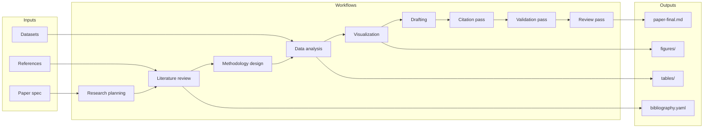
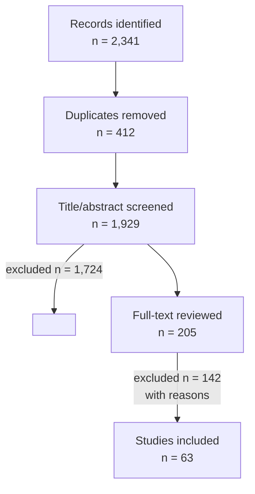
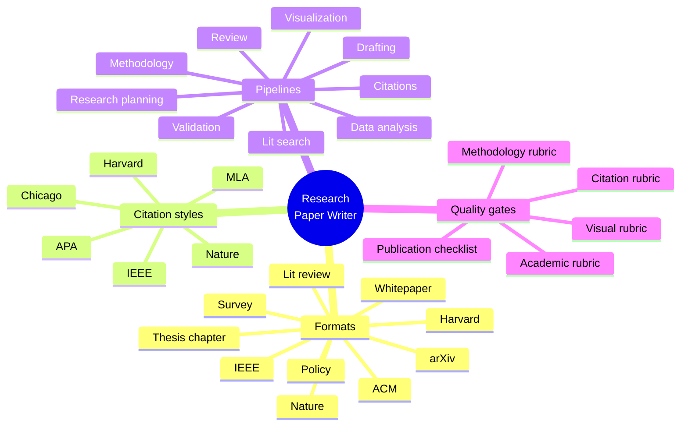
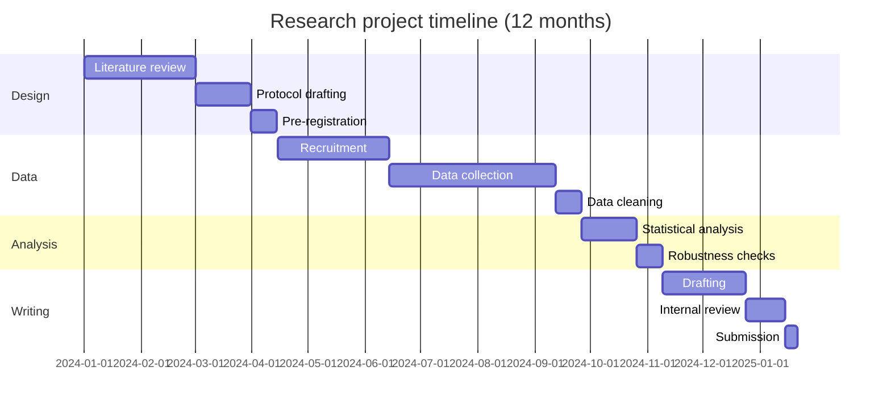

# Sample Visualizations

This file shows the **Mermaid fallback** outputs the skill produces when
Python plotting is unavailable. They embed inline in any Markdown
renderer (GitHub, GitLab, Obsidian, VS Code preview, Pandoc, etc.) and
are fully reproducible source-controlled artifacts.

---

## 1. Architecture diagram

System architecture for a retrieval-augmented research-paper pipeline.



**Figure 1.** End-to-end pipeline: inputs (left) flow through the
orchestration workflows (middle) into versioned outputs (right). Each
workflow step persists artifacts to disk before the next begins.

---

## 2. PRISMA flow diagram

For systematic / scoping literature reviews.



**Figure 2.** PRISMA 2020 flow diagram for the example scoping review.
n = 63 studies were included after two-reviewer screening
(κ = 0.74).

---

## 3. Process flowchart

How the citation pipeline transforms a draft.

```mermaid
flowchart TD
    A[paper-draft.md<br/>with [cite_key] placeholders] --> B[Parse cite keys]
    B --> C[Validate against bibliography.yaml]
    C -->|missing keys| Z[Halt &<br/>request correction]
    C -->|valid| D[Build appearance index]
    D --> E[Disambiguate same-author/year]
    E --> F[Format in-text citations<br/>per chosen style]
    F --> G[Build reference list]
    G --> H[paper-cited.md +<br/>citation-report.md]
```

**Figure 3.** Citation pipeline. Missing or incomplete entries halt the
pipeline; the report enumerates exactly what's wrong so the writer agent
can fix it.

---

## 4. Mind map

Skill scope and capabilities.



**Figure 4.** Mind map of the skill's surface area: 10 formats × 7
citation styles × 9 pipelines, gated by 4 rubrics and a publication
checklist.

---

## 5. Project timeline (Gantt)

Example research project schedule.



**Figure 5.** Gantt chart of a 12-month research project. Critical-path
items (recruitment → data collection → analysis) total 7 months;
buffer time should be allocated proportionally.

---

## 6. Comparative table

When a chart is overkill.

| Method                 | Accuracy | Latency  | Cost    | Reproducibility | Best for                          |
| ---------------------- | -------- | -------- | ------- | --------------- | --------------------------------- |
| Vanilla LLM            | 3.39     | 1.2 s    | 4,300 t | Code: Y, Data: Y | Quick prototypes                  |
| Park et al. (2023)      | 3.60     | 1.8 s    | 5,200 t | Code: Y, Data: N | Strong baseline                   |
| **RA-Review (ours)**     | **3.87** | 1.5 s    | **2,950 t** | Code: Y, Data: Y | Production code review            |

**Table 1.** Comparison of code-review approaches on the consolidated
benchmark (n = 4,212). **Bold:** best per column. Cost is mean
input + output tokens per pull request. Accuracy is blinded reviewer
usefulness rating, 1–5 Likert.

---

## When the Python toolchain is available

The skill produces real charts (PNG + SVG) instead. Run:

```bash
python scripts/generate_charts.py --self-test
```

If `matplotlib`, `seaborn`, `pandas`, and `numpy` all show as
"available", the skill will emit publication-quality raster + vector
figures that follow the defaults in
`references/visualization-guide.md §6` (Okabe-Ito palette, 300 DPI,
no chart-junk).
