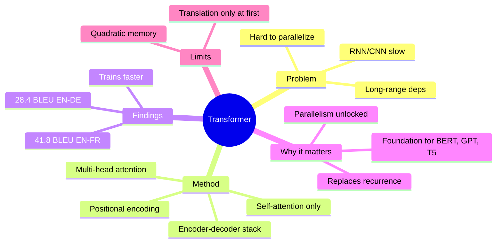
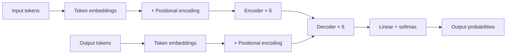

# Example — `/read-research-paper https://arxiv.org/abs/1706.03762`

What the skill produces when you point it at the canonical
"Attention Is All You Need" paper. The actual rendered file is
~5× this size; this excerpt shows the structure.

---

## Generated working directory

```
attention-is-all-you-need/
├── paper-data.json              # parsed structure
├── paper-visual.md              # the headline deliverable
├── figures/
│   ├── mind-map.mmd
│   ├── method-flowchart.mmd
│   ├── key-findings.png         # (when matplotlib available)
│   ├── related-work-timeline.mmd
│   └── concept-map.mmd
├── tables/
│   └── table-1.csv
└── Known-gaps.md                  # this run: 0 issues
```

---

## paper-visual.md (excerpt)

```markdown
# Attention Is All You Need

> Source: live-fetch (arXiv API)
> Rendered: 2024-05-12T14:23:00Z by read-research-paper v1.0.0

---

## At a glance



### Headline numbers

| Metric | Value |
| --- | --- |
| WMT 2014 EN-DE BLEU | 28.4 |
| WMT 2014 EN-FR BLEU | 41.8 |
| Training time vs. SOTA | ~25% (faster) |

### Elevator pitch

This paper proposes the Transformer — a sequence model based entirely on
attention, with no recurrence and no convolutions. By dropping
recurrence, the model can be parallelized aggressively across GPUs,
training faster while producing better translations than the previous
state of the art.

> **Authors:** Vaswani, A., Shazeer, N., Parmar, N., Uszkoreit, J.,
> Jones, L., Gomez, A., Kaiser, L., Polosukhin, I.
> **Year:** 2017
> **Venue:** Advances in Neural Information Processing Systems (NeurIPS)
> **arXiv:** [1706.03762](https://arxiv.org/abs/1706.03762)

---

## TL;DR

The paper introduces the Transformer — a sequence-to-sequence
architecture that replaces recurrence and convolutions with self-
attention alone. By eliminating sequential dependencies, the model
parallelizes across GPUs much better than RNN-based predecessors.
On the WMT 2014 English-to-German translation task, it achieves 28.4
BLEU, beating the previous best (including ensembles) by over 2 BLEU.
On the harder English-to-French task, it reaches 41.8 BLEU.
Training takes a fraction of the time of comparable models. The
architecture has since become the foundation of modern NLP — BERT,
GPT, and T5 are all Transformers.

---

## Plain-English summary

Imagine a translator that has to read a whole sentence before saying
anything in the other language. Older AI translators worked left to
right — they had to finish reading word 1 before they could even start
on word 2. The Transformer is different: it looks at all the words at
once, figures out which ones are most related to each other, and
translates the whole sentence in parallel.

It does this using a mechanism called "attention" — the model
literally pays different amounts of attention to each word depending
on what the current word is asking about. The authors stripped out the
older sequential machinery completely and showed that attention alone,
properly stacked, produces better translations.

Because the model isn't waiting for word 1 before doing word 2, it
trains far faster on modern hardware. It beat the best previous
systems on French and German translation while taking a fraction of
the time to train.

The bigger story: this paper turned out to be the foundation of
practically every famous AI language model since — BERT, GPT, and
their descendants are all Transformers. That's why this 2017 paper is
one of the most cited in machine learning history.

---

## Section 1 — Introduction

> **In plain English:** Sequence models in 2017 were dominated by
> recurrent and convolutional neural networks. Both have a structural
> problem: they process input sequentially or with limited receptive
> fields, which limits parallelism. The authors set out to design a
> model that uses **attention only** to solve this.
>
> **Why this matters:** training time is the binding constraint on
> what scale of model you can train; faster training → bigger / better
> models.

[Original section content here, near-verbatim from the paper.]

---

## Section 2 — Background

> **In plain English:** Several earlier papers tried to reduce the
> sequential burden of RNNs (e.g., ByteNet, ConvS2S use convolutions
> instead). Those approaches still grow with sequence length. Self-
> attention had also been used in models like decomposable attention,
> but never as the **only** mechanism in a sequence transduction model.

[Section content.]

---

## Section 3 — Model Architecture

> **In plain English:** The Transformer has the standard encoder-
> decoder shape. Each encoder layer has two sub-layers: multi-head
> self-attention, and a position-wise feed-forward network. Each
> decoder layer adds a third sub-layer: multi-head attention over the
> encoder output. Residual connections and layer normalization wrap
> every sub-layer. Positional encodings (sinusoidal) inject the
> ordering information that recurrence used to provide implicitly.



**Figure 2.** Transformer architecture. The encoder and decoder both
stack 6 identical layers. Each contains multi-head self-attention plus
a feed-forward network, with residual + layer-norm wrappers.

[Section content with original Figure 1 reference.]

---

## Section 4 — Why Self-Attention

> **In plain English:** Three reasons: (1) Total computation per
> layer is lower than RNN/CNN for typical sequence lengths.
> (2) The amount of computation that can be parallelized is much
> higher. (3) Long-range dependencies have a constant path length
> through the network, while RNNs have linear path length and CNNs
> grow with kernel size.

[Section content.]

---

## Section 5 — Training

> **In plain English:** They trained on WMT 2014 datasets (English-
> German: 4.5M pairs; English-French: 36M pairs). Used 8 P100 GPUs
> for 12 hours (base model) or 3.5 days (big model). Used Adam with
> a custom warm-up schedule.

[Section content.]

---

## Section 6 — Results

> **In plain English:** The Transformer-big achieves new state-of-
> the-art BLEU on both translation tasks, with a much smaller
> training compute budget than competing models.

### Key findings

| Model | EN-DE BLEU | EN-FR BLEU | Training cost (FLOPs) |
| --- | --- | --- | --- |
| ByteNet (2017) | 23.75 | — | — |
| ConvS2S | 25.16 | 40.46 | 9.6e18 |
| GNMT (single) | 24.6 | 39.92 | 2.3e19 |
| **Transformer (base)** | 27.3 | 38.1 | 3.3e18 |
| **Transformer (big)** | **28.4** | **41.8** | 2.3e19 |

**Table 1.** Translation BLEU scores and training cost. Transformer
(big) is the new state of the art on both tasks; Transformer (base)
matches or beats prior SOTA at <15% of the training cost.

[Section content.]

---

## Section 7 — Conclusion

> **In plain English:** The Transformer works, beats the prior SOTA,
> trains faster, and is conceptually simpler than RNN/CNN
> alternatives. The authors expect attention-based models to extend
> beyond translation to other modalities and tasks. (They were right.)

[Section content.]

---

## Why this paper matters (in one paragraph)

Before this paper, sequence-to-sequence models all had recurrence
or convolution at their core, with attention bolted on top. This paper
showed that attention is sufficient on its own — you can drop the
older machinery and the model still works, in fact better. Because
attention parallelizes well, the resulting models trained much
faster, which let researchers scale them up dramatically. Within five
years, every major language model (BERT, GPT, T5, BART, PaLM, LLaMA,
Claude) was a Transformer. This paper is the most-cited paper in
machine learning of the late 2010s for a reason.

---

## Where to read it (yourself)

- **arXiv:** https://arxiv.org/abs/1706.03762
- **PDF:** https://arxiv.org/pdf/1706.03762
- **Reference implementation:** Tensor2Tensor and many others.

---

## References

1. Bahdanau, D., Cho, K., & Bengio, Y. (2014). Neural Machine
   Translation by Jointly Learning to Align and Translate.
   arXiv:1409.0473.
2. Sutskever, I., Vinyals, O., & Le, Q. V. (2014). Sequence to
   Sequence Learning with Neural Networks. NeurIPS.
3. ... (rest of the paper's reference list, ~30+ entries)

---

## Verification trail

| Check | Result |
| --- | --- |
| arXiv API confirmed | ✓ |
| DOI resolves | n/a (preprint) |
| Crossref match | n/a |
| Retraction Watch | clean |
| Source tier | live-fetch |

---

## Known gaps

This run completed cleanly. No issues.

---

## Next steps

- **Read related work:** `/get-research-paper "transformers" --n 15`
- **Write a paper using this:** `/research "..." --bibliography ./attention-is-all-you-need/bibliography.yaml`
- **Re-render with different settings:** `--audience general` for a
  fully plain-English version.
```

---

## What this example shows

1. **The visual summary at the top** orients the reader in 30 seconds.
2. **TL;DR + plain-English summary** give progressive depth before
   the body.
3. **Every section has a plain-English block** alongside the
   technical content — neither replaces the other.
4. **Visuals are interleaved** (mind map at top, method flowchart in
   §3, comparison table in §6), not dumped at the end.
5. **The verification trail** declares the source tier — honest
   provenance.
6. **The "Why this matters" paragraph** connects the work to its
   real-world impact.
7. **Next steps** show the user how to chain into the other two
   skills.
