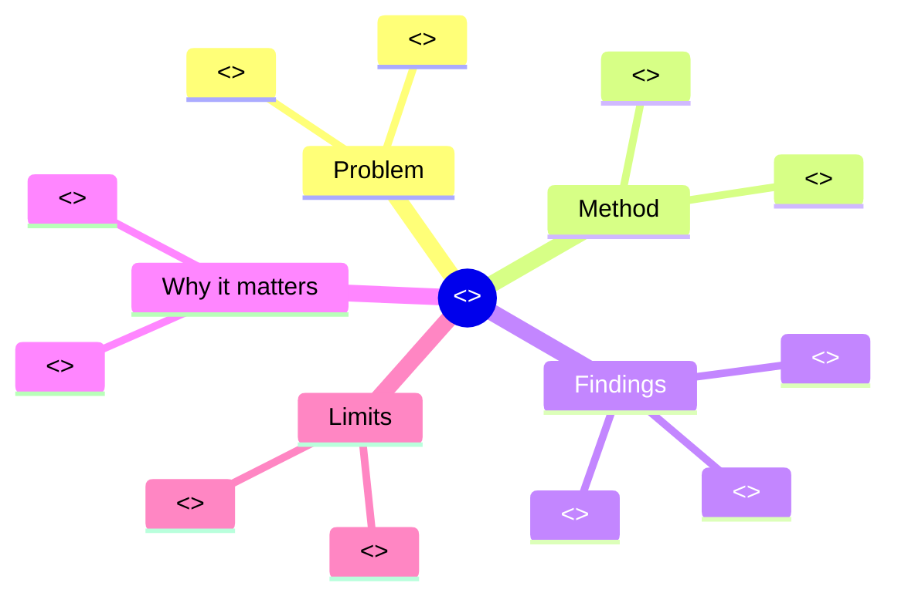
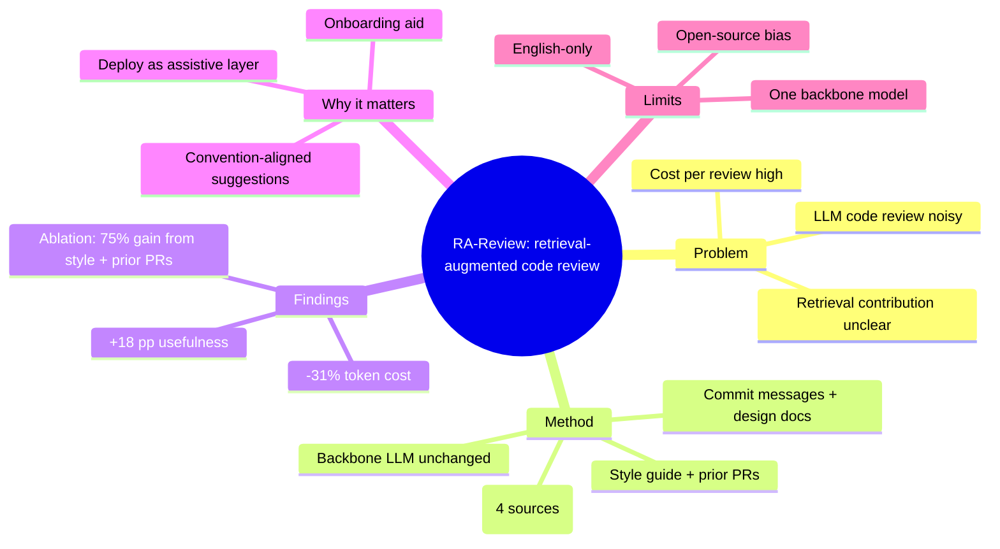
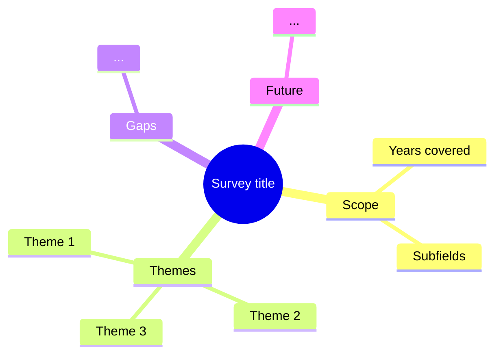
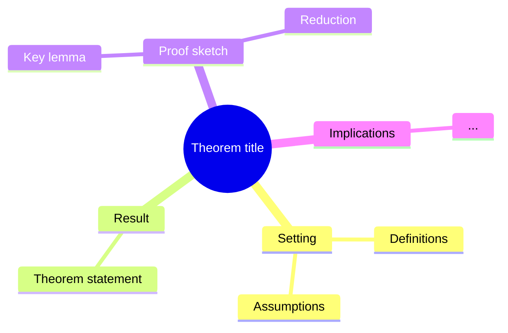
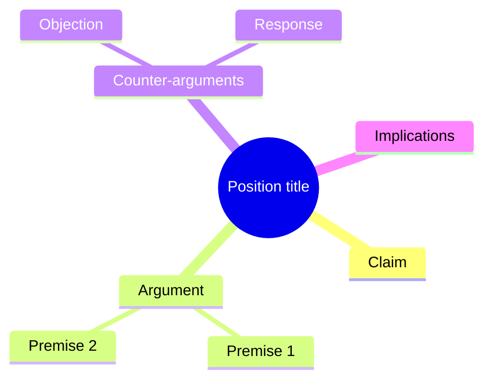

# Prompt: Generate Mind Map

The mind map is the **first thing** the reader sees. It orients them
to the paper in one glance. Get it right.

---

## Output format

Always Mermaid `mindmap`:



5 root branches max. Each branch has 2–4 leaves.

---

## Use this prompt verbatim

```
You are generating a Mermaid mindmap for a research paper. The mindmap
will be the first thing readers see — it orients them in one glance.

Paper:
  Title: <title>
  Abstract: <abstract>
  Sections: <list of detected section names>
  Headline numbers (from results): <comma-separated numbers>
  Limitations (if extracted): <list>

Generate a Mermaid mindmap with these branches:

1. **Problem** — what gap or question motivated the paper? (2-3 leaves)
2. **Method** — what approach did the paper take? (2-4 leaves)
3. **Findings** — what did they find? Use headline numbers. (2-4 leaves)
4. **Why it matters** — implications. (2-3 leaves)
5. **Limits** — what the paper does NOT show. (1-3 leaves)

Constraints:
- Branches: exactly the 5 above (in this order).
- Leaves: 1-7 total per branch, 2-4 ideal.
- Each leaf: ≤ 6 words. Use abbreviations.
- Root: paper title abbreviated to ≤ 6 words. Use the form
  ((Title abbreviated)) for round node.
- Output ONLY valid Mermaid (a fenced ``` mermaid ... ``` block).
- Don't invent facts. If the paper doesn't have a clear
  "Limits" branch, leaf it with "Acknowledged in §<n>".
- Don't pad with empty leaves. If a branch genuinely only has 1
  meaningful idea, use 1 leaf.

Output the Mermaid block. Nothing else.
```

---

## Example

**Input:**

> Title: Retrieval-Augmented Generation for Code-Review Comments
>
> Abstract: We propose RA-Review, a retrieval-augmented LLM
> code-review pipeline. On 4,212 pull requests across three
> repositories, RA-Review achieves +18 pp usefulness and 31% lower
> token cost vs. vanilla LLM. Ablation shows style guides and prior
> PRs drive most of the gain.
>
> Sections: introduction, related work, method, evaluation, results,
> discussion, limitations
>
> Headline numbers: 18 pp, 31%, 4212 PRs, 3 repositories
>
> Limitations: open-source bias, single-backbone model, English-only

**Output:**



---

## Anti-patterns

- ❌ More than 5 root branches.
- ❌ Branches with 10+ leaves (mind map becomes a wall of text).
- ❌ Leaves longer than 6 words.
- ❌ Inventing "limitations" the paper doesn't acknowledge.
- ❌ Generic root nodes like "Paper" or "Research".
- ❌ Branch names other than the canonical 5
  (Problem / Method / Findings / Why it matters / Limits).

---

## When to deviate from the canonical 5 branches

For papers that don't fit the empirical mold:

### Survey / review papers



### Theoretical / mathematical papers



### Position / opinion papers



When deviating, match the paper's actual structure — don't force-fit
the canonical 5 if it misrepresents the paper.

---

## Rendering tips

The Mermaid mindmap is rendered inline in the output Markdown. Most
viewers (GitHub, GitLab, Obsidian, VS Code preview, Pandoc with
mermaid filter) render it natively.

For static export to PDF / DOCX:

```bash
mmdc -i figures/mind-map.mmd -o figures/mind-map.png -t default
```

The skill's toolchain emits both `.mmd` (source) and `.png`
(when `mmdc` is available).
