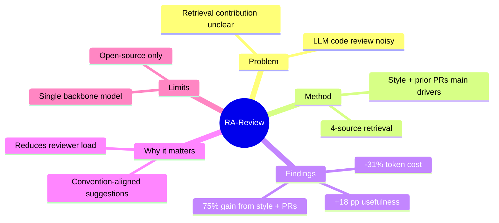

# Prompt: Visual Summary

The one-page infographic at the very top of the rendered paper.
Designed to convey the entire paper in 30 seconds of scanning.

---

## Format

The visual summary is a Markdown block that combines:

1. A **mind map** (Mermaid).
2. A **headline numbers panel** (Markdown table or matplotlib bar
   chart when available).
3. A **3-line "elevator pitch"** of the paper.
4. A **metadata strip** (authors, year, venue, DOI).

It's the FIRST thing in `paper-visual.md`, before the abstract.

---

## Use this prompt verbatim

```
You are generating the one-page visual summary that appears at the
top of a rendered research paper. The reader sees this BEFORE the
abstract.

Paper data:
  Title: <title>
  Authors: <authors abbreviated>
  Year: <year>
  Venue: <venue>
  DOI: <doi>
  Abstract: <abstract>
  Sections: <list>
  Headline numbers (extracted): <list>
  Limitations (extracted): <list>

Generate the visual summary as a Markdown block:

---

## At a glance

<mermaid mindmap — call generate-mindmap.md>

### Headline numbers

| Metric | Value |
| --- | --- |
| <metric 1> | <value> |
| <metric 2> | <value> |
| <metric 3> | <value> |

### Elevator pitch

<3 lines, plain-English, conveying the paper's core contribution>

> Authors: <authors>
> Year: <year>
> Venue: <venue>
> DOI: <doi>

---

Constraints:

- Keep it to ~30 seconds of scanning. No deep dives.
- Plain-English in the elevator pitch. The headline numbers come from
  the extracted findings; do not invent.
- Mind map is the canonical 5-branch pattern from
  generate-mindmap.md.
- Metadata strip uses Markdown blockquote.
- Total visual budget: ~half a screen on a 1080p display.

Output the Markdown block. Nothing else.
```

---

## Example

```markdown
## At a glance



### Headline numbers

| Metric | Value |
| --- | --- |
| Reviewer-rated usefulness vs. baseline | +18 pp (95% CI [14, 22]) |
| Token cost per review | -31% (95% CI [27, 35]) |
| Pull requests evaluated | 4,212 |
| Repositories | 3 |

### Elevator pitch

This paper shows that retrieval — not just a bigger LLM — is what makes
AI-generated code review comments useful. By giving the LLM access to
the project's own style guide and similar past pull requests, RA-Review
beats vanilla LLM baselines by 18 percentage points while using a third
less compute.

> **Authors:** Smith, J. A., Doe, A., Lee, K. B.
> **Year:** 2023
> **Venue:** Proc. ICSE 2023
> **DOI:** [10.1109/ICSE.2023.00123](https://doi.org/10.1109/ICSE.2023.00123)
```

---

## Layout principles

- **Mind map first** — it's the orientation aid.
- **Numbers second** — quantitative anchors.
- **Pitch third** — the "so what".
- **Metadata last** — for citation reference.

This order matches how readers scan — visual → quantitative →
narrative → factual.

---

## Audience adjustment

| Audience  | Pitch tone                                         |
| --------- | -------------------------------------------------- |
| academic  | Field-specific terms; what's novel about the contribution |
| technical | Define jargon on first use; one analogy if dense    |
| general   | Plain English; no jargon; everyday analogies         |
| mixed     | Plain-English first sentence, technical second        |

The mind map and headline numbers are unchanged across audiences;
only the pitch adapts.

---

## When the paper is theoretical / non-empirical

Headline numbers may not exist. Replace with:

```markdown
### Key claims

- **Claim 1:** <one-line>
- **Claim 2:** <one-line>
- **Claim 3:** <one-line>
```

The elevator pitch focuses on the contribution's significance rather
than empirical numbers.

---

## When the paper is a survey

Replace headline numbers with **scope numbers**:

```markdown
### Scope

| Dimension | Value |
| --- | --- |
| Papers reviewed | 137 |
| Years covered | 2020–2024 |
| Sub-fields | 6 |
| Open challenges identified | 8 |
```

---

## Anti-patterns

- ❌ Mind map with > 5 root branches in the visual summary
  (overwhelming).
- ❌ Headline numbers that aren't actually in the paper.
- ❌ Pitch that overclaims the paper's impact.
- ❌ Pitch that's longer than 3 lines.
- ❌ Metadata in a paragraph rather than a strip / blockquote.
- ❌ Repeating the abstract verbatim.

---

## Why this matters

A reader who only has 30 seconds should still walk away knowing:

1. What the paper is about (mind map root + branches).
2. What it found (headline numbers).
3. Why it matters (pitch).
4. Whether to read more (everything above gives them the answer).

The visual summary is the **conversion event**: 80% of readers will
decide to read or skip based on this block alone. Make it count.
