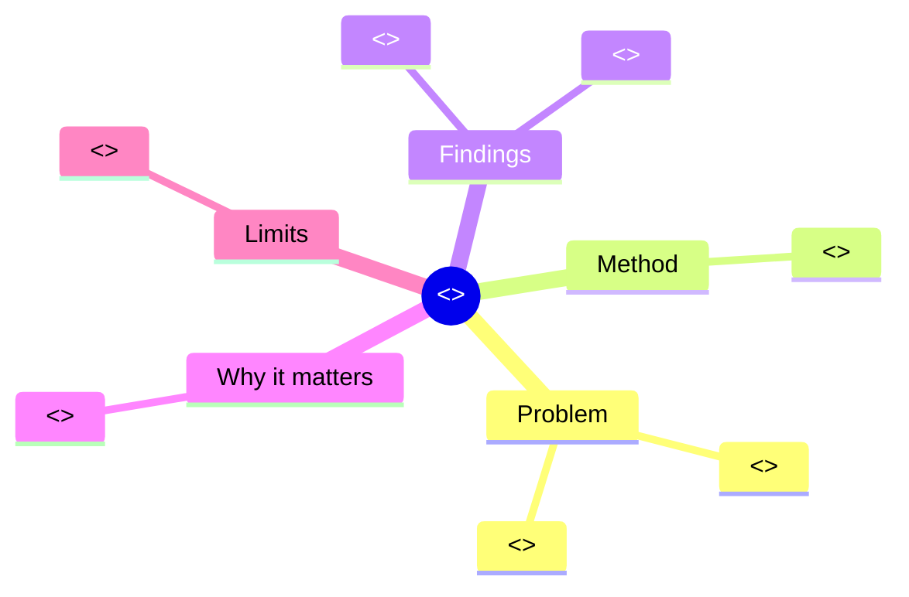

# One-Page Infographic Template

The standalone single-page summary triggered by `/tldr-paper <input>`.
Designed to be readable in 60 seconds; printable on a single page.

---

```markdown
# <<Paper title>>

<<Subtitle: 1-line plain-English what-is-this>>



---

## The big numbers

| | Value | What it means |
| --- | --- | --- |
| **<<metric 1>>** | <<value>> | <<one-line plain-English>> |
| **<<metric 2>>** | <<value>> | <<one-line plain-English>> |
| **<<metric 3>>** | <<value>> | <<one-line plain-English>> |

---

## In one paragraph (plain English)

<<5-8 sentences. The same plain-English summary as the full
rendering — copy-paste OK.>>

---

## Method (one diagram)

```mermaid
flowchart LR
    <<simplified flowchart — at most 6 nodes>>
```

---

## Compared to baselines

| Method | <<metric>> |
| --- | --- |
| Baseline A | <<value>> |
| Baseline B | <<value>> |
| **Proposed** | **<<value>>** |

---

## What's NOT shown (limitations)

- <<limitation 1>>
- <<limitation 2>>
- <<limitation 3>>

---

## Source

> Authors: <<...>>
> Year: <<YYYY>>
> Venue: <<...>>
> DOI: [<<10.xxx/yyy>>](https://doi.org/<<10.xxx/yyy>>)
> arXiv: <<2403.01234>>

---

> Rendered by `read-research-paper` v<<version>>.
> Source: <<live-fetch | cache | bundled-corpus | model-knowledge>>.
```

---

## Use cases

This template is the output for `/tldr-paper`. It's also embedded as
the FIRST page of the full visual rendering when `--depth standard`
or `deep`.

A reader can:
- Print this single page and stick it on the wall.
- Share it as a one-pager on Slack.
- Use it as the "what's this paper about" answer in a journal club.

---

## Visual budget

Strict: at most **2 visuals** in this template.

- 1 mind map (always).
- 1 method flowchart (when applicable).
- Tables don't count as visuals.

If the paper is theoretical with no method flowchart, replace with a
**concept map** (Mermaid mindmap) of the key concepts introduced.

---

## Length

Strict: fits on a single 8.5×11" or A4 page when printed.

Approximate budget:

| Element | Lines |
| --- | --- |
| Title + subtitle | 2 |
| Mind map | 12-15 |
| Big numbers table | 4-6 |
| Plain-English paragraph | 6-10 |
| Method flowchart | 6-8 |
| Comparison table | 4-6 |
| Limitations | 3-5 |
| Source block | 5 |
| **Total** | ~50-60 lines |

If the rendering exceeds this, prune from the bottom up:

1. Drop the limitations bullets to 2.
2. Drop comparison-table rows to 3.
3. Reduce mind-map leaves per branch from 4 to 3.

---

## Honest provenance

The infographic always declares its source tier in the footer:

> Source: live-fetch | cache | bundled-corpus | model-knowledge

A reader who shares the infographic can see immediately whether the
data was verified against the live paper or came from a fallback.

---

## Anti-patterns

- ❌ Cramming 5 visuals onto one page (overwhelming).
- ❌ Tiny font sizes when rendered as PDF.
- ❌ Removing the limitations section to save space — keep them
  always.
- ❌ Inventing a metric to fill the table.
- ❌ Hiding the source tier.
- ❌ Using the infographic format when the paper actually has
  multiple sub-papers' worth of contributions (split into two
  infographics instead).

---

## Variation: the "comparison infographic"

When the paper directly compares two or more approaches:

```markdown
| | Approach A | Approach B |
| --- | --- | --- |
| Idea | ... | ... |
| Strength | ... | ... |
| Weakness | ... | ... |
| Best for | ... | ... |
| Performance | ... | ... |
```

This becomes the central visual instead of a flowchart. Used for
"head-to-head" papers, comparative studies, A/B test reports.
