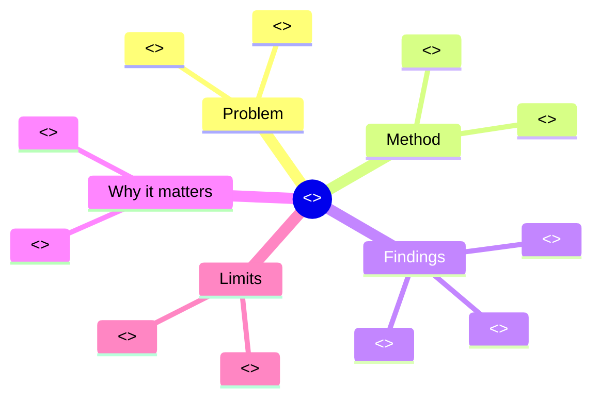
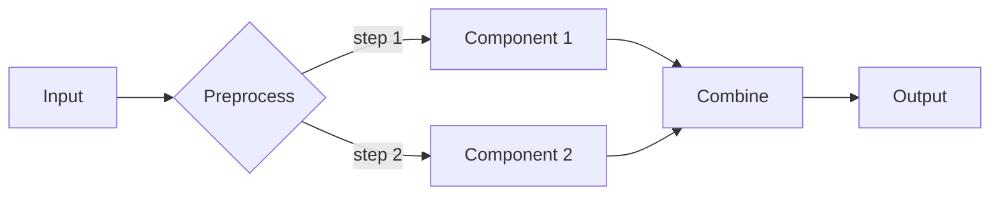

# Visualization Workflow

How to decide which visuals to generate for a given paper, and how to
render each one.

---

## 1. The visualization budget

Per `--visuals` mode:

| Mode         | Min visuals | Max visuals | What's required                     |
| ------------ | ----------- | ----------- | ----------------------------------- |
| `none`       | 0           | 0           | (text-only output)                   |
| `minimal`    | 2           | 3           | Mind map + method flowchart           |
| `auto` (default) | 4         | 6           | Mind map + flowchart + key-findings + comparison table |
| `max`        | 6           | 12          | All of `auto` + concept map + timeline + author network + extracted figures |

The skill always errs on the side of generating **what's possible from
what's actually in the paper**, not what's prescribed.

---

## 2. Decision tree

For each candidate visual, ask:

### Mind map

- Always generate one. It's the top-of-doc orientation aid.
- Input: paper structure (sections + 2–3 key concepts per section).
- Renderer: Mermaid `mindmap`.
- File: `figures/mind-map.mmd`.

### Method flowchart

- Generate if the paper has a method / approach / system / pipeline
  section.
- Skip if the paper is purely theoretical / mathematical.
- Input: ordered steps from the method section.
- Renderer: Mermaid `flowchart LR` (or `TD` if > 6 steps).
- File: `figures/method-flowchart.mmd`.

### Key-findings infographic

- Generate if the results section has ≥ 1 quantitative finding.
- Input: 3–6 headline numbers from the results.
- Renderer: matplotlib bar chart (when Python available); else
  Markdown table.
- File: `figures/key-findings.{png,svg}` or inline Markdown.

### Comparison table

- Generate if the paper has a benchmark / comparison table.
- Otherwise skip.
- Input: extracted table from the paper.
- Renderer: Markdown table; CSV in `tables/`.

### Related-work timeline

- Generate if the paper has ≥ 5 references with extractable years.
- Renderer: Mermaid `gantt`-style timeline OR a chronological bar
  list grouped by year.
- File: `figures/related-work-timeline.mmd`.

### Concept map (`max` only)

- Generate when the paper introduces ≥ 5 named concepts.
- Renderer: Mermaid `mindmap` rooted at the paper's main contribution.
- File: `figures/concept-map.mmd`.

### Author network (`max` only)

- Generate when the paper has ≥ 3 authors with affiliations.
- Renderer: Mermaid `flowchart` showing authors → affiliations.
- File: `figures/author-network.mmd`.

### Figure pass-through

- For each figure extractable from the paper, copy / re-encode it to
  `figures/extracted/figure-N.png` with the original caption.
- If extraction fails, attempt a Mermaid alternative based on the
  caption.

---

## 3. Rendering tools

### Mermaid (always available)

Mermaid blocks render natively in GitHub, GitLab, Obsidian, VS Code
preview, Pandoc, etc. Used for:

- Mind maps (`mindmap`)
- Flowcharts (`flowchart LR/TD`)
- Timelines (`gantt`)
- Class / sequence diagrams (when relevant)
- Author networks (`flowchart`)

### matplotlib (optional)

When `pandas` + `matplotlib` are installed:

```bash
python toolchains/extract_pdf.py --self-test
```

Used for:

- Key-findings bar charts
- Trend lines (when results report time-series)
- Per-method comparison charts
- Distribution plots (when paper reports distributions)

### Markdown tables (always available)

Used for:

- Comparison tables
- Reference lists
- Extracted paper tables

---

## 4. Mind map structure (canonical pattern)



This 5-branch pattern works for almost any empirical paper.

---

## 5. Method flowchart pattern



Adjust:
- For training pipelines: add a feedback loop.
- For multi-stage: use subgraphs.
- For decision-heavy: use diamond shapes (`{decision}`).

---

## 6. Key-findings infographic pattern

When the paper reports something like "achieves 87% accuracy,
outperforming the baseline by 12 percentage points":

### As Markdown (always)

| Metric           | Baseline | Proposed | Δ        |
| ---------------- | -------- | -------- | -------- |
| Accuracy          | 75%      | **87%**  | +12 pp   |
| F1                | 0.71     | **0.83**  | +0.12    |
| Latency (ms)      | 42       | 48       | +6       |
| Energy (J)         | 1.20     | **0.95** | -0.25    |

### As matplotlib (when available)

Bar chart of the metrics, with baselines greyed and proposed
highlighted, error bars showing reported CIs.

---

## 7. Caption pattern (every visual)

Every generated visual gets a caption in the four-part format:

> **Figure N.** [What it shows]. [Method note: source, n, what
> bars/lines/colors mean]. [Interpretation in 1–2 sentences].
> [Reference to where it's discussed in the paper].

Example:

> **Figure 1.** Conceptual mind map of the paper's structure.
> Branches are sections; leaves are key ideas extracted from each
> section. The Findings branch annotates the three headline numbers
> from §6 of the paper.

---

## 8. Visual quality gates

Per visual, check:

- [ ] Mind maps have ≤ 5 root branches.
- [ ] Flowcharts have ≤ 12 nodes (else split into sub-flows).
- [ ] Tables fit on a screen width (≤ 8 columns).
- [ ] All visuals have an interpretive caption.
- [ ] All visuals are referenced in the prose.
- [ ] No visual fabricates data not in the paper.

Failures: regenerate with stricter constraints; if still failing,
drop the visual and add to `Known-gaps.md`.

---

## 9. Layout in the output

The `paper-visual.md` template (`templates/visual-paper.md`)
specifies where each visual goes:

```
[Top]                ← One-page infographic (mind map + headline numbers)
[TL;DR]
[Plain-English summary]
[Section 1 visual]   ← Method flowchart (if §1 is method) or topic illustration
[Section 1 prose]
...
[Key findings infographic] ← After results section
[Comparison table]    ← Inline in results / discussion
[Related work timeline] ← Before references
[Concept map]         ← Before conclusion (if `max`)
[Author network]       ← In a footer (if `max`)
[References]
```

---

## 10. Anti-patterns

- ❌ Inventing data points to fill a chart.
- ❌ Mind maps with 50 branches — overwhelming.
- ❌ Flowcharts with no labels on edges.
- ❌ Comparison tables that aren't actually in the paper.
- ❌ Timelines with arbitrary years.
- ❌ Pretty-but-empty charts (axis labels missing, no units).
- ❌ Visuals that contradict the paper's own findings.
- ❌ Three-bar charts with all the same value.

When in doubt, **fewer, higher-quality** visuals beat many shallow ones.
