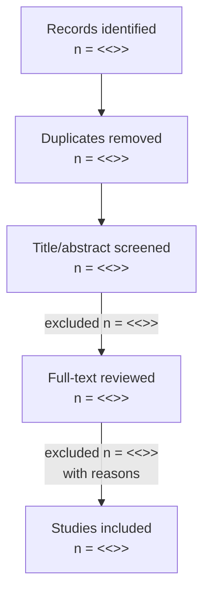

# Literature Review Template

Use as a **standalone literature review paper** (not just §2 "Related Work"
of an empirical paper). For systematic / scoping / narrative reviews; pick
the variant in `references/literature-review-guide.md`.

> Replace every `<<...>>`. Default citation: Harvard (author, year).

---

```markdown
# <<A [Systematic|Scoping|Narrative|Survey] Review of <topic>>>

**Authors:** <<…>>
**Affiliations:** <<…>>

## Abstract

- **Background:** <<1–2 sentences>>
- **Objectives:** <<the research question(s)>>
- **Methods:** <<review type, databases searched, date range, n included>>
- **Results:** <<2–3 sentences with the key thematic findings + headline number>>
- **Conclusions:** <<implications and gaps>>

**Plain-English summary.** <<5–10 sentences for non-specialists.>>

**Keywords:** <<6–10 keywords>>

---

## 1. Introduction

### 1.1 Background

<<Why the topic matters now.>>

### 1.2 Existing reviews

<<Acknowledge prior reviews on the topic; explain what's different here.>>

### 1.3 Objectives and research questions

- **RQ1:** <<…>>
- **RQ2:** <<…>>
- **RQ3:** <<…>>

### 1.4 Contributions

- A <<systematic / scoping>> review of <<n>> studies published <<YYYY–YYYY>>.
- A <<taxonomy / framework>> of <<…>> derived from the literature.
- An evidence map showing <<gap>>.
- A research agenda comprising <<n>> open questions.

---

## 2. Methods

### 2.1 Review type

<<Systematic review following PRISMA 2020 / scoping review following Arksey &
O'Malley (2005) and JBI guidance / etc.>>

### 2.2 Search strategy

**Databases:** <<Scopus, Web of Science, IEEE Xplore, ACM DL, arXiv, PubMed,
Google Scholar>>.

**Search string** (adapted per database):

```
("<<term group 1>>" OR …)
AND
("<<term group 2>>" OR …)
AND
("<<term group 3>>" OR …)
```

**Date range:** <<YYYY-MM-DD to YYYY-MM-DD>>.

**Languages:** <<English / multilingual>>.

Verbatim search strings per database in **Appendix A**.

### 2.3 Inclusion / exclusion criteria

| Inclusion criterion         | Exclusion criterion                  |
| --------------------------- | ------------------------------------ |
| <<Peer-reviewed empirical>>  | <<Editorials, opinion pieces>>       |
| <<Published 2018–2024>>      | <<Older than 2018>>                  |
| <<English language>>         | <<Non-English (resource constraint)>> |
| <<Topic match X>>            | <<Off-topic>>                         |
| <<…>>                        | <<…>>                                 |

### 2.4 Screening procedure

<<Two reviewers independently screened titles/abstracts; conflicts resolved
by discussion / third reviewer. Cohen's κ = <<value>>.>>

**Figure 1.** PRISMA 2020 flow diagram.



### 2.5 Quality assessment

<<Tool used (CASP / JBI / MMAT / AMSTAR / custom). Each study scored.
Quality scores in Appendix C.>>

### 2.6 Data extraction

<<Standardized form covering author, year, country, sample, method,
findings, limitations. Full table in Appendix B.>>

### 2.7 Synthesis approach

<<Narrative / thematic / meta-analytic. If meta-analysis: random-effects
pooling, I², τ², publication bias check.>>

---

## 3. Overview of Included Studies

**Table 1.** Characteristics of included studies (n = <<n>>).

| ID | Author (Year) | Country | Method | Sample | Topic |
| -- | ------------- | ------- | ------ | ------ | ----- |
| 1  | Smith (2023)  | UK      | Survey | n = 240 | <<…>> |
| 2  | Doe (2022)    | US      | RCT     | n = 180 | <<…>> |
| …  | …             | …       | …      | …      | …     |

**Figure 2.** Distribution of included studies by year of publication.

**Figure 3.** Map of included studies by country.

**Figure 4.** Distribution by methodology.

---

## 4. Findings — Thematic Synthesis

### 4.1 Theme 1: <<…>>

<<Synthesis of <<n>> studies that addressed this theme.>>

**Agreement.** <<…>> (Smith, 2023; Doe, 2022; Lee, 2021).

**Disagreement.** <<…>> Whereas Smith (2023) reports X, Doe (2022)
reports Y; possible reasons include <<…>>.

**Quality of evidence.** <<…>> studies in this theme scored <<…>> on the
quality rubric.

### 4.2 Theme 2: <<…>>

<<…>>

### 4.3 Theme 3: <<…>>

<<…>>

### 4.4 Cross-cutting observations

<<Patterns that span themes.>>

**Figure 5.** Evidence map / heatmap — themes × methods showing where the
evidence is concentrated and where it is thin.

---

## 5. (Optional) Meta-Analysis

### 5.1 Effect-size standardization

<<…>>

### 5.2 Pooled estimate

**Figure 6.** Forest plot of standardized mean differences across <<n>>
studies. Pooled SMD = <<>>, 95% CI [<<>>, <<>>], I² = <<>>%.

### 5.3 Publication bias

**Figure 7.** Funnel plot. Egger's test: t = <<>>, p = <<>>.

### 5.4 Sub-group / meta-regression

<<Explore sources of heterogeneity.>>

---

## 6. Gaps and Open Problems

- **Gap 1.** <<…>> — only <<n>> studies addressed it; mostly in <<setting>>.
- **Gap 2.** <<…>>
- **Gap 3.** <<…>>

---

## 7. Future Research Agenda

For each gap, a concrete RQ:

- **RQ-A:** <<specific question>> — *suggested method:* <<…>>;
  *expected challenges:* <<…>>.
- **RQ-B:** <<…>>
- **RQ-C:** <<…>>

---

## 8. Limitations of This Review

<<Database coverage, language bias, publication bias, screening reliability,
synthesis subjectivity.>>

---

## 9. Conclusion

<<3–5 sentences. The state of the field, the gaps, the call to action.>>

---

## References

<<Alphabetical, Harvard format.>>

---

## Appendices

**A. Search strings per database.**

**B. Full data-extraction table.**

**C. Quality assessment scores.**

**D. PRISMA checklist.**

**E. Studies excluded at full-text stage with reasons.**
```

---

## Skill-specific instructions

1. The **PRISMA flow diagram** (Mermaid) is mandatory for systematic reviews.
2. **Inter-rater reliability** (κ) reported for the screening stage.
3. The **search string** must be reproducible — verbatim in Appendix A.
4. Quality scores per study reported in Appendix C.
5. Themes (§4) are derived inductively or deductively — declare which.
6. Meta-analysis section (§5) included only when ≥ 5 studies report
   comparable effect sizes; otherwise narrative / thematic synthesis only.
7. The "Future research agenda" (§7) is the **highest contribution** of a
   review — make it specific and actionable.
