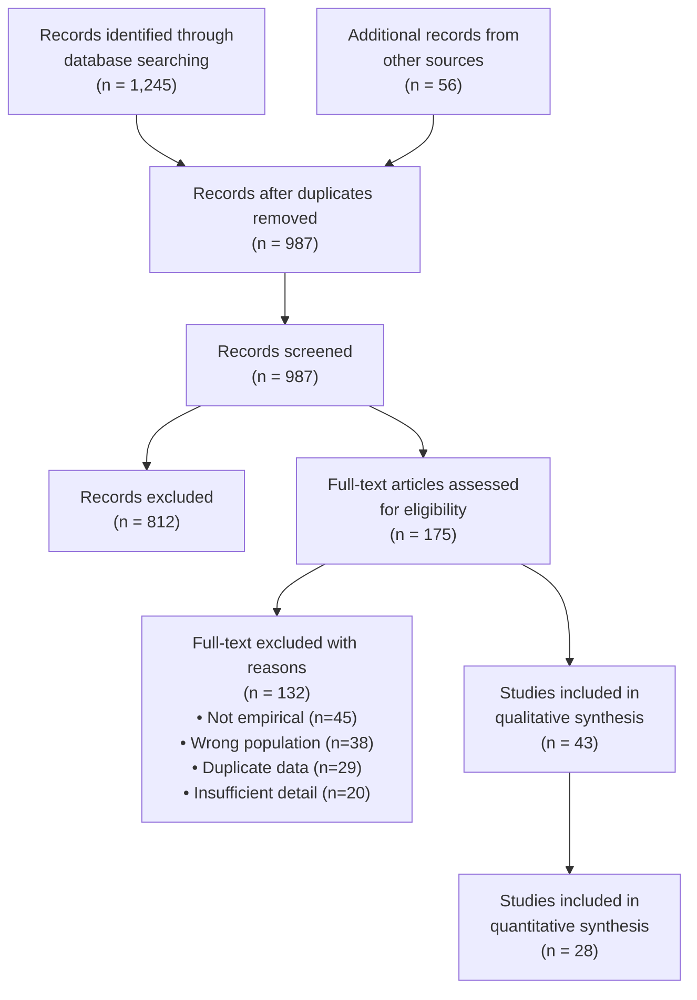
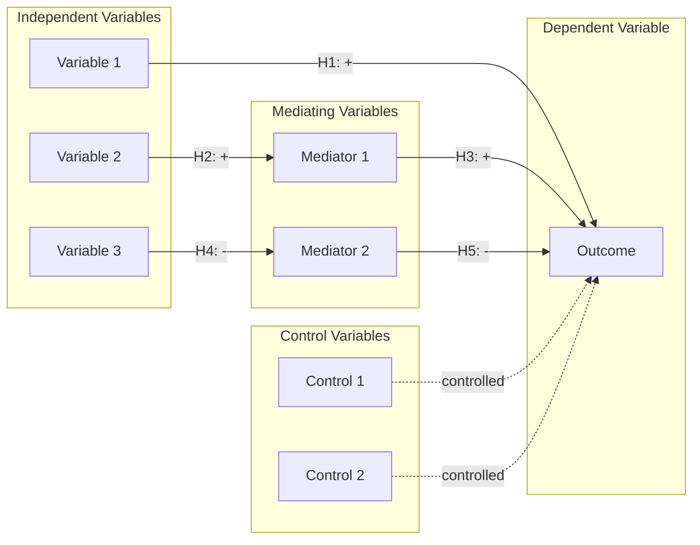

# Chart Code Templates

## Ready-to-use templates for common research visualizations.

---

## Template 1: Grouped Bar Chart (Comparison)

```python
import matplotlib.pyplot as plt
import numpy as np

# DATA - Replace with actual values
categories = ['Cat A', 'Cat B', 'Cat C', 'Cat D', 'Cat E']
group1 = [23, 45, 56, 78, 34]  # e.g., "Before intervention"
group2 = [34, 52, 61, 85, 42]  # e.g., "After intervention"

x = np.arange(len(categories))
width = 0.35

fig, ax = plt.subplots(figsize=(10, 6))
bars1 = ax.bar(x - width/2, group1, width, label='Group 1', color='#5B9BD5', edgecolor='white')
bars2 = ax.bar(x + width/2, group2, width, label='Group 2', color='#ED7D31', edgecolor='white')

ax.set_xlabel('Categories', fontsize=11)
ax.set_ylabel('Values (units)', fontsize=11)
ax.set_title('Comparison Title', fontsize=13, fontweight='bold')
ax.set_xticks(x)
ax.set_xticklabels(categories)
ax.legend(frameon=False)
ax.spines['top'].set_visible(False)
ax.spines['right'].set_visible(False)
ax.set_ylim(0, max(max(group1), max(group2)) * 1.15)

plt.tight_layout()
plt.savefig('grouped_bar.png', dpi=300, bbox_inches='tight', facecolor='white')
```

---

## Template 2: Line Chart with Confidence Interval (Trend)

```python
import matplotlib.pyplot as plt
import numpy as np

# DATA
years = [2018, 2019, 2020, 2021, 2022, 2023, 2024]
values = [12, 18, 15, 28, 35, 42, 55]
ci_lower = [10, 15, 12, 24, 30, 37, 48]
ci_upper = [14, 21, 18, 32, 40, 47, 62]

fig, ax = plt.subplots(figsize=(10, 6))
ax.plot(years, values, 'o-', color='#2196F3', linewidth=2, markersize=6, label='Observed')
ax.fill_between(years, ci_lower, ci_upper, alpha=0.2, color='#2196F3', label='95% CI')

ax.set_xlabel('Year', fontsize=11)
ax.set_ylabel('Metric (units)', fontsize=11)
ax.set_title('Trend Over Time with Confidence Interval', fontsize=13, fontweight='bold')
ax.legend(frameon=False, loc='upper left')
ax.spines['top'].set_visible(False)
ax.spines['right'].set_visible(False)
ax.grid(True, alpha=0.3, linestyle='--')

plt.tight_layout()
plt.savefig('trend_line.png', dpi=300, bbox_inches='tight', facecolor='white')
```

---

## Template 3: Correlation Heatmap

```python
import matplotlib.pyplot as plt
import numpy as np
import seaborn as sns

# DATA - correlation matrix
variables = ['Var A', 'Var B', 'Var C', 'Var D', 'Var E']
corr_matrix = np.array([
    [1.00, 0.85, 0.42, -0.31, 0.67],
    [0.85, 1.00, 0.38, -0.28, 0.72],
    [0.42, 0.38, 1.00, -0.15, 0.29],
    [-0.31, -0.28, -0.15, 1.00, -0.44],
    [0.67, 0.72, 0.29, -0.44, 1.00]
])

fig, ax = plt.subplots(figsize=(8, 7))
mask = np.triu(np.ones_like(corr_matrix, dtype=bool), k=1)  # upper triangle mask

sns.heatmap(corr_matrix, mask=mask, annot=True, fmt='.2f', cmap='RdBu_r',
            center=0, vmin=-1, vmax=1, square=True,
            xticklabels=variables, yticklabels=variables,
            linewidths=0.5, cbar_kws={"shrink": 0.8}, ax=ax)

ax.set_title('Correlation Matrix', fontsize=13, fontweight='bold', pad=15)
plt.tight_layout()
plt.savefig('correlation_heatmap.png', dpi=300, bbox_inches='tight', facecolor='white')
```

---

## Template 4: Scatter Plot with Regression Line

```python
import matplotlib.pyplot as plt
import numpy as np
from scipy import stats

# DATA
x = np.array([2.1, 3.4, 4.2, 5.1, 6.3, 7.2, 8.1, 9.0, 10.2, 11.5])
y = np.array([15, 22, 28, 33, 41, 45, 52, 58, 63, 71])

# Regression
slope, intercept, r_value, p_value, std_err = stats.linregress(x, y)
line_x = np.linspace(min(x), max(x), 100)
line_y = slope * line_x + intercept

fig, ax = plt.subplots(figsize=(8, 6))
ax.scatter(x, y, color='#2196F3', s=60, alpha=0.7, edgecolors='white', linewidth=0.5)
ax.plot(line_x, line_y, '--', color='#FF5722', linewidth=1.5,
        label=f'y = {slope:.2f}x + {intercept:.2f}\n$R^2$ = {r_value**2:.3f}, p = {p_value:.4f}')

ax.set_xlabel('Independent Variable (units)', fontsize=11)
ax.set_ylabel('Dependent Variable (units)', fontsize=11)
ax.set_title('Relationship Between X and Y', fontsize=13, fontweight='bold')
ax.legend(frameon=True, framealpha=0.9, loc='upper left')
ax.spines['top'].set_visible(False)
ax.spines['right'].set_visible(False)

plt.tight_layout()
plt.savefig('scatter_regression.png', dpi=300, bbox_inches='tight', facecolor='white')
```

---

## Template 5: Box Plot Comparison

```python
import matplotlib.pyplot as plt
import numpy as np

# DATA
np.random.seed(42)
data = {
    'Control': np.random.normal(50, 10, 100),
    'Treatment A': np.random.normal(55, 12, 100),
    'Treatment B': np.random.normal(62, 8, 100),
    'Treatment C': np.random.normal(48, 15, 100)
}

fig, ax = plt.subplots(figsize=(8, 6))
bp = ax.boxplot(data.values(), labels=data.keys(), patch_artist=True,
                medianprops=dict(color='black', linewidth=1.5))

colors = ['#E3F2FD', '#BBDEFB', '#64B5F6', '#E1BEE7']
for patch, color in zip(bp['boxes'], colors):
    patch.set_facecolor(color)

ax.set_ylabel('Outcome Measure (units)', fontsize=11)
ax.set_title('Distribution Comparison Across Groups', fontsize=13, fontweight='bold')
ax.spines['top'].set_visible(False)
ax.spines['right'].set_visible(False)
ax.grid(True, axis='y', alpha=0.3, linestyle='--')

plt.tight_layout()
plt.savefig('boxplot_comparison.png', dpi=300, bbox_inches='tight', facecolor='white')
```

---

## Template 6: Stacked Bar (Composition)

```python
import matplotlib.pyplot as plt
import numpy as np

# DATA
categories = ['2020', '2021', '2022', '2023', '2024']
segment1 = [30, 35, 28, 42, 45]
segment2 = [25, 28, 32, 30, 35]
segment3 = [20, 22, 25, 18, 15]
segment4 = [25, 15, 15, 10, 5]

fig, ax = plt.subplots(figsize=(10, 6))
ax.bar(categories, segment1, label='Segment A', color='#2196F3')
ax.bar(categories, segment2, bottom=segment1, label='Segment B', color='#4CAF50')
ax.bar(categories, segment3, bottom=np.array(segment1)+np.array(segment2),
       label='Segment C', color='#FF9800')
ax.bar(categories, segment4,
       bottom=np.array(segment1)+np.array(segment2)+np.array(segment3),
       label='Segment D', color='#9C27B0')

ax.set_xlabel('Year', fontsize=11)
ax.set_ylabel('Percentage (%)', fontsize=11)
ax.set_title('Composition Over Time', fontsize=13, fontweight='bold')
ax.legend(loc='upper right', frameon=False)
ax.spines['top'].set_visible(False)
ax.spines['right'].set_visible(False)

plt.tight_layout()
plt.savefig('stacked_bar.png', dpi=300, bbox_inches='tight', facecolor='white')
```

---

## Template 7: PRISMA Flow Diagram (for Lit Reviews)



---

## Template 8: Research Framework Diagram



---

## Color Palette Reference (Colorblind-Friendly)

```
Professional Blue Scale:  #E3F2FD, #90CAF9, #42A5F5, #1565C0, #0D47A1
Categorical (5 colors):  #2196F3, #4CAF50, #FF9800, #9C27B0, #F44336
Sequential (warm):       #FFF3E0, #FFB74D, #FF9800, #F57C00, #E65100
Diverging (red-blue):    #D32F2F, #EF9A9A, #FFFFFF, #90CAF9, #1565C0
Grayscale:               #F5F5F5, #BDBDBD, #757575, #424242, #212121
```
